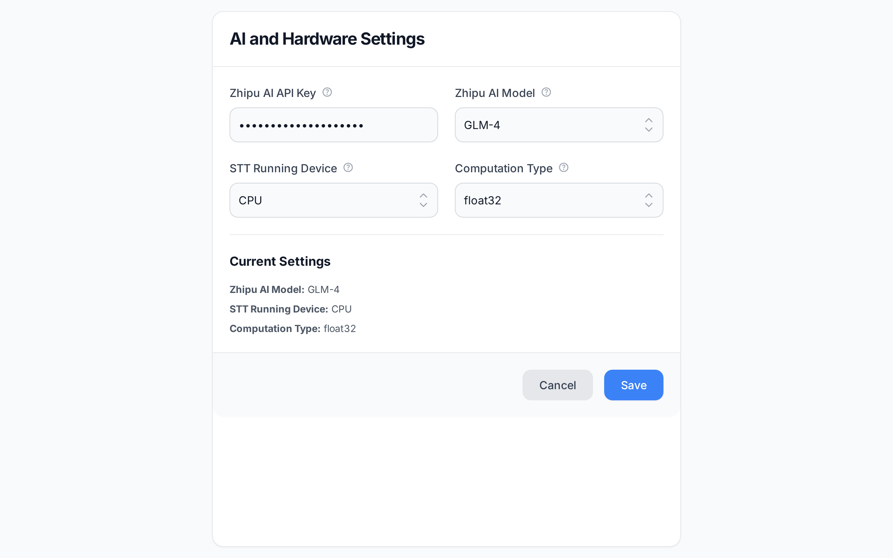

# Translate2me — AI Lecture Companion 📢➡️📝

> 专为留学生、研究人员和专业人士打造的 **本地优先** 智能实时转录 · 同传翻译 · 学术笔记生成工具。



## ✨ Features / 功能亮点

| 功能 | 说明 |
|------|------|
| 🎙️ **实时语音转文字** | 基于 [SenseVoice-Small](https://github.com/FunAudioLLM/SenseVoice) (ONNX) 本地推理，支持 Auto/English/中文/粤语/日本語/한국어 多语种识别 |
| 🌐 **实时同声传译** | 基于 [NLLB-200-Distilled-600M](https://huggingface.co/Xenova/nllb-200-distilled-600M) 本地翻译引擎，句级别实时双语字幕 |
| 📝 **智能学术笔记** | LLM Agent 自动每 60 秒整理转录文本，去口语化、提炼核心概念、生成结构化笔记 |
| 🔌 **多 LLM 厂商** | 一键预设智谱 AI / DeepSeek / OpenAI / Google Gemini / Anthropic Claude / Ollama (本地)，支持任何 OpenAI 兼容 API |
| 🗣️ **智能场景模式** | 日常会话 + 专业授课模式，后者可输入学科名称自动生成领域术语提示词 |
| 🌓 **暗色/浅色主题** | 一键切换 Light / Dark 主题，OLED 纯黑暗色模式 |
| 🌍 **中英双语界面** | 内置 i18n，一键切换中文 / English UI |
| 💾 **一键导出** | 转录原文、翻译笔记均可一键导出为 `.txt` 文件 |

## 🏗 Architecture / 技术架构

```
┌─────────────────────────────────────────────────┐
│               Electron (Node.js)                │
│  ┌──────────┐  ┌──────────┐  ┌──────────────┐   │
│  │SenseVoice│  │ NLLB-600M│  │ LLM API Proxy│   │
│  │  (ONNX)  │  │(Xenova)  │  │ (OpenAI fmt) │   │
│  └────┬─────┘  └────┬─────┘  └──────┬───────┘   │
│       │ ASR         │ NMT          │ Refine     │
├───────┴─────────────┴──────────────┴─────────────┤
│              React + Vite + Tailwind             │
│          (Monochrome Minimalist Design)          │
└─────────────────────────────────────────────────┘
```

- **ASR**: `sherpa-onnx` + SenseVoice-Small — 本地离线语音识别
- **NMT**: `@xenova/transformers` + NLLB-200-Distilled-600M — 本地离线翻译
- **LLM**: 任何 OpenAI 兼容 API — 笔记整理/提示词生成
- **Frontend**: React 18 + TypeScript + Tailwind CSS 3 + Lucide Icons
- **Desktop**: Electron 28 — 跨平台桌面应用

## 💻 System Requirements / 系统要求

- **OS**: Windows 10/11 (主要测试环境)
- **RAM**: 8GB+ (推荐，运行 SenseVoice + NLLB 模型)
- **Node.js**: 18+
- **磁盘**: ~2GB（模型文件）

## 📦 Installation / 安装指南

### 1. 克隆仓库

```bash
git clone https://github.com/Poetrynan/Translate2me.git
cd Translate2me
```

### 2. 安装前端依赖

```bash
cd frontend
npm install
```

### 3. 下载模型文件

本项目需要以下模型文件（首次运行时会自动下载 NLLB，但 SenseVoice 需手动放置）：

```
models/
└── sensevoice/
    ├── model.onnx          # SenseVoice-Small ONNX 模型
    ├── tokens.txt          # Token 词表
    └── ...

bin/
└── sherpa-onnx-offline.exe # sherpa-onnx 离线推理二进制
```

> 模型可从 [SenseVoice GitHub](https://github.com/FunAudioLLM/SenseVoice) 和 [sherpa-onnx releases](https://github.com/k2-fsa/sherpa-onnx/releases) 获取。

### 4. 启动开发模式

```bash
cd frontend
npm run electron:dev
```

## 🚀 Usage / 使用方法

1. **选择输入设备** — 从配置栏下拉选择麦克风
2. **选择模式** — 日常会话 / 专业授课
3. **设置语言对** — 选择源语言和目标语言
4. **点击录制按钮** — 中间的圆形按钮开始 / 停止录制
5. **实时查看结果** — 左侧面板显示转录原文，右侧显示翻译笔记和同传字幕
6. **整理笔记** — 点击"立即整理笔记"按钮，LLM 将对转录文本进行翻译 + 去口语化 + 结构化整理

### 配置 LLM

点击右上角 ⚙️ 设置图标：
- **一键预设**: 快速选择智谱 AI、DeepSeek、OpenAI、Gemini、Claude、Ollama
- **自定义**: 填入任何 OpenAI 兼容的 API Base URL、API Key 和模型名称

## 📁 Project Structure / 项目结构

```
Translate2me/
├── frontend/
│   ├── src/
│   │   ├── App.tsx          # 主组件 (UI + 业务逻辑 + i18n)
│   │   └── index.css        # 全局样式 & 动画
│   ├── electron/
│   │   ├── main.js          # Electron 主进程 (ASR/NMT/LLM 调度)
│   │   ├── preload.js       # 安全 IPC 桥接
│   │   └── launch.js        # 开发模式启动脚本
│   ├── tailwind.config.js   # Tailwind 主题配置
│   └── package.json
├── bin/                     # sherpa-onnx 二进制
├── models/                  # SenseVoice ONNX 模型
├── config/                  # config.json (运行时自动生成)
└── README.md
```

## ⚙️ Configuration / 配置文件

配置自动保存在 `config/config.json`：

```json
{
  "llm_base_url": "https://open.bigmodel.cn/api/paas/v4/chat/completions",
  "zhipuai_api_key": "",
  "zhipuai_model": "glm-4-flash",
  "stt_device": "cpu",
  "stt_compute_type": "int8",
  "source_language": "English",
  "target_language": "中文",
  "locale": "zh"
}
```

## 🙏 Acknowledgments / 鸣谢

- [SenseVoice](https://github.com/FunAudioLLM/SenseVoice) — 高效多语种语音识别
- [sherpa-onnx](https://github.com/k2-fsa/sherpa-onnx) — 本地 ONNX 推理引擎
- [NLLB-200](https://huggingface.co/Xenova/nllb-200-distilled-600M) — Meta 多语种翻译模型
- [Xenova/transformers.js](https://github.com/xenova/transformers.js) — 浏览器 / Node.js 推理框架
- [Electron](https://www.electronjs.org/) — 跨平台桌面框架
- [React](https://react.dev/) + [Vite](https://vitejs.dev/) + [Tailwind CSS](https://tailwindcss.com/)
- [Lucide Icons](https://lucide.dev/) — 精美图标库

## 📜 License / 许可证

本项目采用 **GNU General Public License v3.0 (GPLv3)** 进行许可。

---

🎯 **Translate2me** — 让跨语言学习和工作更高效！
